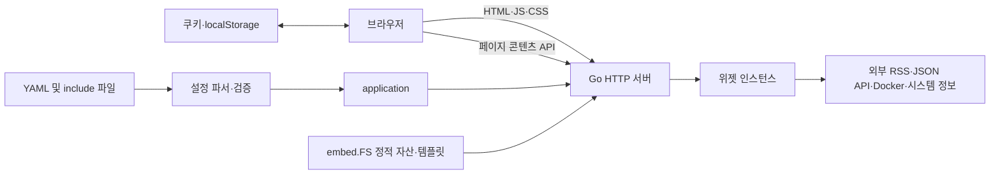
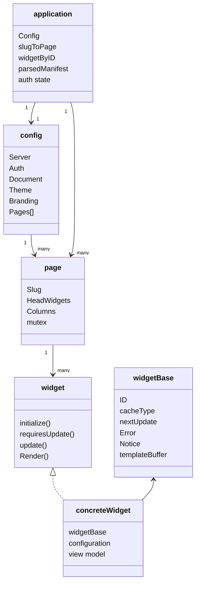
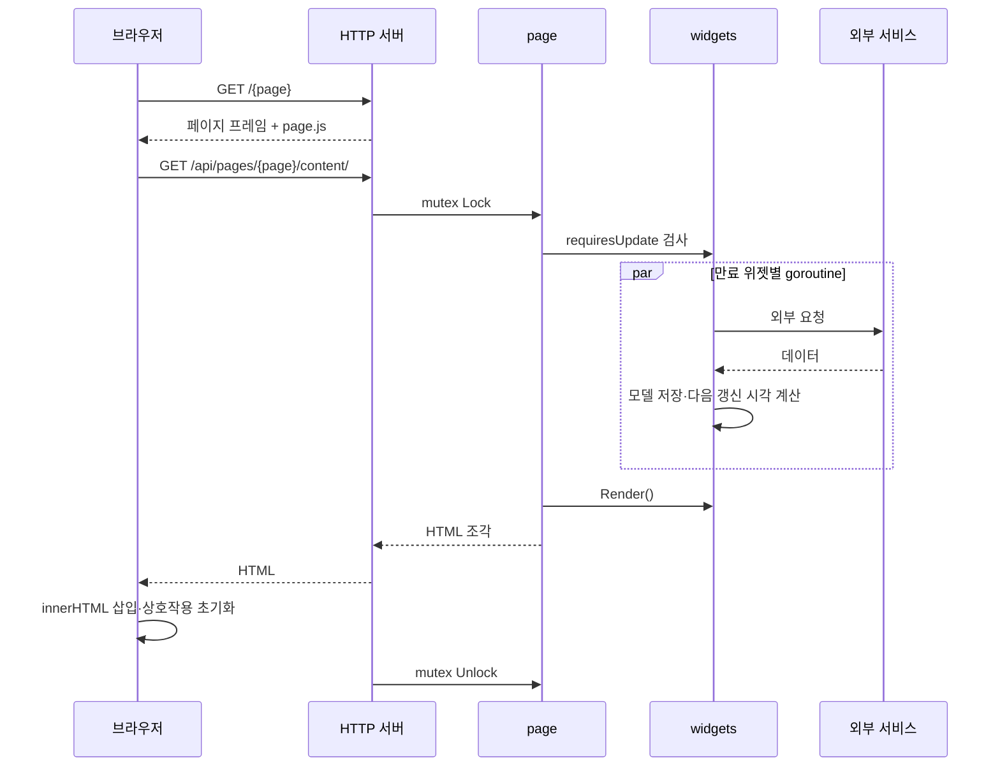

# 아키텍처

## 시스템 성격

Glance는 다음 속성을 가진 모놀리식 웹 애플리케이션이다.

- 하나의 Go 실행 파일이 설정 파싱, 외부 데이터 수집, 캐시, HTML 렌더링, 정적 파일 제공을 모두 담당한다.
- 데이터베이스가 없으며 서버 상태는 프로세스 메모리에만 존재한다.
- UI는 서버가 만든 HTML 조각을 브라우저가 삽입하는 방식이다.
- 외부 서비스 호출은 페이지가 요청될 때만 발생한다. 백그라운드 폴링은 없다.
- 설정 파일 변경은 프로세스 재시작이 아니라 내부 HTTP 서버 인스턴스 교체로 반영된다.

## 시스템 컨텍스트

## 계층별 구성

### 프로세스 진입과 CLI

- 루트 [../../main.go](../../main.go)는 `glance.Main()`의 종료 코드를 `os.Exit`에 전달한다.
- [../../internal/glance/cli.go](../../internal/glance/cli.go)는 인자 파싱과 진단용 보조 명령을 담당한다.
- [../../internal/glance/main.go](../../internal/glance/main.go)는 선택된 명령 실행과 서버 생명주기를 담당한다.

### 구성과 애플리케이션 모델

- [../../internal/glance/config.go](../../internal/glance/config.go)는 YAML include, 변수 치환, 파일 감시, 논리 검증을 담당한다.
- `config`는 서버, 인증, document head, 테마, 브랜딩, 페이지 배열을 보유한다.
- `application`은 config의 값 복사본과 페이지·위젯 인덱스, 렌더링된 manifest, 인증 상태를 보유한다.
- `page`는 head 위젯, 열, 기본 모바일 열 인덱스와 페이지 단위 mutex를 보유한다.

### 위젯 계층

- [../../internal/glance/widget.go](../../internal/glance/widget.go)의 `widget` 인터페이스가 초기화, 갱신 필요 여부, 갱신, 렌더링, 요청 처리 계약을 정의한다.
- `widgetBase`가 ID, 공통 YAML 속성, 캐시 시각, 오류와 notice, 템플릿 버퍼를 제공한다.
- 개별 `widget-*.go` 파일은 설정 필드, 수집 로직, 화면용 모델을 함께 소유한다.
- `group`과 `split-column`은 `containerWidgetBase`를 통해 하위 위젯의 초기화와 갱신을 위임한다.

### 렌더링과 자산

- [../../internal/glance/templates.go](../../internal/glance/templates.go)는 공통 템플릿 함수와 템플릿 파싱을 담당한다.
- [../../internal/glance/embed.go](../../internal/glance/embed.go)는 `templates`와 `static` 디렉터리를 바이너리에 포함한다.
- CSS의 `@import`는 프로세스 초기화 시 재귀적으로 펼쳐 하나의 메모리 번들을 만든다.
- 프론트엔드에는 Node.js, 패키지 매니저, 번들러가 없다.

### 시스템 정보 패키지

- [../../pkg/sysinfo/sysinfo.go](../../pkg/sysinfo/sysinfo.go)는 호스트, CPU, 메모리, swap, 온도, mountpoint 정보를 수집하는 유일한 별도 내부 패키지다.
- `server-stats` 위젯이 로컬 수집에 직접 사용하고, 원격 서버에서는 `/api/sysinfo/all` 형식과 호환되는 응답을 기대한다.

## 핵심 객체 관계

실제 구현은 상속이 아니라 Go의 인터페이스와 구조체 임베딩을 사용한다. 구체 위젯이 `widgetBase`를 임베딩하고 부족한 메서드를 구현해 `widget` 인터페이스를 만족한다.

## 요청과 갱신 데이터 흐름

페이지 mutex는 갱신과 템플릿 실행 전체를 감싼다. 같은 페이지에 대한 동시 콘텐츠 요청은 직렬화되지만 서로 다른 페이지는 병렬로 처리된다. 한 페이지 내부에서는 갱신이 필요한 최상위 위젯마다 goroutine을 생성하고 모두 끝날 때까지 기다린다.

## 프로세스 내 상태

| 상태 | 위치 | 수명 |
| --- | --- | --- |
| 파싱된 설정 | `application.Config` | 설정 재로드까지 |
| 위젯 결과와 캐시 시각 | 각 위젯 구조체 | 설정 재로드까지 |
| RSS ETag·Last-Modified 캐시 | RSS 위젯 | 설정 재로드까지 |
| Reddit OAuth 토큰 | Reddit 위젯 | 설정 재로드 또는 토큰 만료까지 |
| Pi-hole 세션 ID | DNS 위젯 | 설정 재로드 또는 세션 교체까지 |
| 호스트 기본 정보 | `pkg/sysinfo` 전역 | 프로세스 종료까지 |
| 실패한 로그인 시도 | `application.failedAuthAttempts` | 설정 재로드까지, 오래된 항목은 로그인 요청 시 정리 |
| 정적 파일 해시와 CSS 번들 | 패키지 전역 | 프로세스 종료까지 |
| To-do 항목 | 브라우저 localStorage | 브라우저 프로필과 YAML `id`가 유지되는 동안 |
| 테마 선택 | 브라우저 쿠키 | 2년 또는 쿠키 삭제까지 |
| 로그인 세션 | 브라우저 쿠키 | 14일, 남은 기간 7일 이하일 때 재발급 |

## 동시성 구조

- 페이지별 mutex가 페이지 데이터 갱신과 렌더링 사이의 일관성을 보장한다.
- 페이지 내부 최상위 위젯은 제한 없는 개별 goroutine으로 갱신된다.
- 일부 위젯은 다시 worker pool을 사용한다. 기본 worker 수는 10이고, Hacker News는 30, ChangeDetection은 15로 지정한다.
- `server-stats`, `repository`, Custom API subrequest 등은 자체 `WaitGroup` 병렬화를 사용한다.
- [../../internal/glance/singleflight.go](../../internal/glance/singleflight.go)는 동일 작업의 중복 실행을 합치는 제네릭 구현을 제공하며 RSS/Reddit 등 공유 데이터 취득에 사용된다.
- worker pool의 context 설정 메서드는 주석 처리되어 현재 생성되는 job은 `context.Background()`를 사용한다.

## 코드 규모와 분포

분석 시점 기준 저장소에는 Go 파일 49개, HTML/Go template 파일 43개, JavaScript 파일 9개, CSS 파일 25개가 있다. `internal/glance` 최상위 Go 코드는 약 10,084줄이다. 대부분의 도메인 로직이 하나의 `glance` 패키지에 모여 있고 `pkg/sysinfo`만 분리되어 있다.
