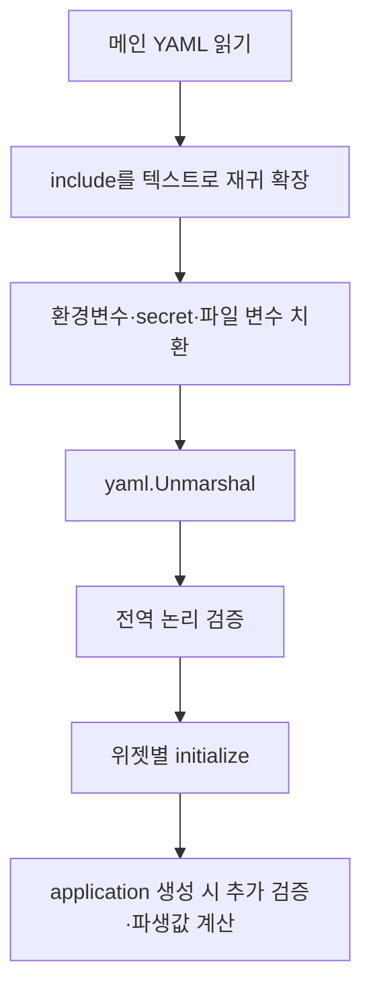

# 설정 처리 구현

## 최상위 모델

[../../internal/glance/config.go](../../internal/glance/config.go)의 `config`는 다음 섹션으로 구성된다.

| 섹션 | 내부 용도 |
| --- | --- |
| `server` | bind host/port, proxy 신뢰 여부, 외부 base URL, 사용자 assets 경로 |
| `auth` | 64바이트 secret과 username별 password 또는 bcrypt hash |
| `document` | `<head>`에 삽입할 신뢰된 HTML |
| `theme` | 기본 HSL 속성, 사용자 CSS, picker 사용 여부, 순서 보존 preset map |
| `branding` | footer, 로고, favicon, PWA 이름·아이콘·배경색 |
| `pages` | 페이지, 열, head widgets와 일반 widgets |

`yaml.v3.Unmarshal`을 직접 사용하며 `KnownFields(true)`를 사용하지 않는다. 따라서 구조체에 없는 YAML 키는 오류가 아니라 무시된다.

## 처리 순서

`config:print`는 B 결과를 출력하고 C 이후는 출력하지 않는다. `config:validate`는 F까지 실행한다. 실제 서버 생성은 G까지 수행한다.

## Include 처리

- 행 전체가 `$include: 경로` 또는 `!include: 경로` 형식인 경우 동작한다.
- list item 위치의 `- $include:`도 지원한다.
- 상대 경로는 include를 선언한 파일의 디렉터리를 기준으로 해석한다.
- include 파일의 각 행에는 선언 위치의 들여쓰기를 접두한다.
- 재귀 깊이는 최대 20이며, 별도의 cycle set 대신 이 한도로 순환 참조를 차단한다.
- 파싱 결과와 include 절대 경로 집합은 파일 watcher 구성에도 사용한다.

이 기능은 YAML AST 병합이 아니라 YAML을 읽기 전에 수행하는 정규식 기반 텍스트 치환이다.

## 변수 치환

지원 형식은 다음과 같다.

| 형식 | 소스 |
| --- | --- |
| `${NAME}` | 프로세스 환경변수 `NAME` |
| `${env:NAME}` | 동일한 환경변수 방식 |
| `${secret:name}` | `/run/secrets/name` 파일 내용 |
| `${readFileFromEnv:NAME}` | 환경변수 값이 가리키는 절대 경로의 파일 내용 |
| `\${NAME}` | 치환하지 않고 `${NAME}` 리터럴로 사용 |

일반 환경변수 이름은 대문자, 숫자, underscore만 허용한다. 존재하지 않는 정상 형식의 환경변수는 설정 오류다. secret과 파일 내용은 양 끝 공백을 제거한다. `readFileFromEnv`는 절대 경로만 허용한다.

치환은 YAML 파싱 전에 전체 byte slice에 정규식으로 적용되므로 YAML의 key나 구조 자체도 바꿀 수 있다. 주석 내부도 예외 처리하지 않으므로 주석에 정상 패턴이 있으면 치환 또는 누락 변수 오류가 발생한다.

## 사용자 정의 필드 타입

[../../internal/glance/config-fields.go](../../internal/glance/config-fields.go)에 다음 decoder가 있다.

- `hslColorField`: `h s l`, comma 구분, `hsl(...)` 형태를 허용하고 hue 0–360, saturation/lightness 0–100을 검증한다.
- `durationField`: 정수와 `s`, `m`, `h`, `d` 단위만 받는다. 복합 duration은 지원하지 않는다.
- `customIconField`: 일반 URL 또는 `si:`, `di:`, `mdi:`, `sh:` 접두사를 CDN URL로 변환한다. 확장자는 svg/png/webp로 제한한다.
- `proxyOptionsField`: 문자열 URL 또는 URL·TLS 검증 해제·timeout 객체 형식을 받아 전용 `http.Client`를 만든다.
- `queryParametersField`: scalar나 배열의 문자열·숫자·bool을 `url.Values`로 변환한다.
- `orderedYAMLMap`: 테마 preset 순서를 유지하며 중복 key를 오류로 처리한다.

## 전역 검증 규칙

현재 구현이 검사하는 주요 조건은 다음과 같다.

- page가 최소 하나 있어야 한다.
- 인증 사용 시 secret key가 있어야 한다.
- username은 비어 있지 않고 최소 3자다.
- 각 사용자는 password 또는 password-hash가 필요하고 평문 password는 최소 6자다.
- `assets-path`는 지정 시 존재해야 한다.
- page name은 필수다.
- page width와 desktop navigation width는 빈 값, `wide`, `slim`, `default` 중 하나다.
- page에는 column이 최소 하나 있어야 한다.
- slim page는 최대 2열, 나머지는 최대 3열이다.
- column size는 `small` 또는 `full`이다.
- page마다 `full` column이 1개 또는 2개 있어야 한다.

위젯별 필수 값과 enum은 각 `initialize()`가 별도로 검증하거나 기본값으로 교정한다. 설정 검증이 전역 함수와 application 생성 과정 두 곳에 나뉘어 있다는 점은 소스의 TODO에도 명시되어 있다.

## 페이지 파생값

application 생성 시 다음 변환이 추가로 적용된다.

- 첫 페이지를 `/`용 빈 slug에도 연결한다.
- 누락된 slug를 page title에서 생성한다.
- `login`, `logout` slug를 거부한다.
- page width의 `default`를 빈 문자열로 정규화한다.
- desktop navigation width가 비어 있으면 정규화된 page width를 복사한다.
- 첫 번째 `full` column을 모바일 기본 선택 열로 기록한다.
- 각 최상위 위젯을 ID map에 등록하고 정적 자산 resolver를 주입한다.

## 테마와 브랜딩 초기화

- picker가 활성화되면 내장 `default-dark`, `default-light` preset과 사용자 preset을 순서 보존 map으로 합친다.
- 사용자 preset이 동일 key를 사용하면 값을 덮어쓰되 기본 순서 위치는 유지한다.
- 각 테마는 template을 통해 CSS와 preview HTML로 미리 컴파일된다.
- 기본 app name은 `Glance`, favicon은 내장 SVG, app icon은 내장 PNG다.
- app background color가 없으면 현재 theme 배경색의 hex 값을 사용한다.
- `/assets/`로 시작하는 사용자 CSS·logo 경로에는 `base-url`을 붙인다.

`document.head`, `branding.custom-footer`, `html` 위젯 source는 `template.HTML`로 역직렬화되므로 escaping 없이 출력되는 관리자 신뢰 입력이다.

## 파일 감시와 재로드

- 메인 파일과 모든 include 파일을 개별적으로 감시한다.
- Write 이벤트는 500ms debounce 후 다시 읽는다.
- Rename 이벤트는 파일이 다시 생기는지 200ms 간격으로 최대 10회 확인한다.
- Remove 이벤트도 include 집합에서 제거한 뒤 재파싱한다.
- include 목록이 변하면 watcher 대상도 갱신한다.
- 펼친 최종 YAML bytes가 이전 값과 같은 경우 application을 재생성하지 않는다.

파일 감시 코드는 debounce timer, watcher goroutine, 파싱 callback 사이의 상태를 mutex로 보호한다. 관련 구간에는 구현 자체가 `flaky`하다고 표시한 TODO가 남아 있다.

