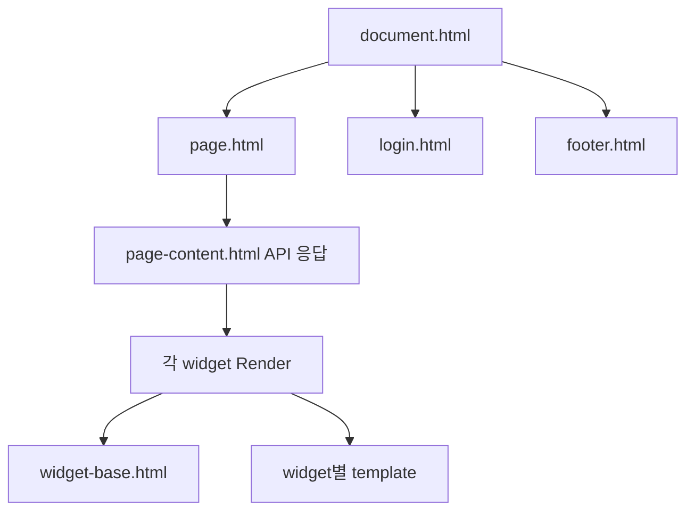

# 프론트엔드 구현

## 구성 방식

프론트엔드는 별도 빌드 단계가 없는 서버 렌더링 HTML, native ES module, CSS로 구성된다.

- HTML: [../../internal/glance/templates](../../internal/glance/templates)
- JavaScript: [../../internal/glance/static/js](../../internal/glance/static/js)
- CSS: [../../internal/glance/static/css](../../internal/glance/static/css)
- Font: 내장 JetBrains Mono WOFF2
- 이미지·아이콘: favicon, app icon, release source SVG

Go의 `html/template`이 서버 측 escaping과 context별 attribute 처리를 담당한다. 일부 설정과 helper는 명시적으로 `template.HTML`, `template.URL`, `template.CSS`, `template.HTMLAttr`을 반환한다.

## 템플릿 계층

`document.html`은 `pageData` 전역 객체, title/meta/PWA link, CSS bundle, theme style, 사용자 CSS와 document head를 만든다. page와 login template이 block을 정의해 document skeleton을 재사용한다.

`page.html`은 다음을 렌더링한다.

- desktop navigation과 logo
- theme picker와 logout action
- mobile navigation과 column radio controls
- 비어 있는 `#page-content`
- loading indicator와 ARIA 상태
- footer

`page-content.html`은 head widgets와 열별 widget HTML만 반환한다.

## 브라우저 부트스트랩

[../../internal/glance/static/js/page.js](../../internal/glance/static/js/page.js)의 `setupPage()`가 module 평가 즉시 실행된다.

1. theme picker 초기화
2. `/api/pages/{slug}/content/` fetch
3. 응답 status 확인 없이 body text 취득
4. `#page-content.innerHTML`에 삽입
5. popover, clock, calendar, todo, carousel, search, collapse, group, masonry, 상대 시간, lazy image 순서로 초기화
6. `content-ready`, `aria-busy=false` 적용
7. 지연 후 잘린 텍스트 title과 column transition 설정

콘텐츠 fetch에는 AbortController timeout, retry, non-200 분기, catch UI가 없다. 네트워크 예외가 발생하면 `setupPage()`가 `try/finally` 구간에 들어가기 전에 reject되어 loading 상태가 유지된다. HTTP 오류 응답은 그대로 text로 받아 `innerHTML`에 삽입한다.

## JavaScript 모듈

| 파일 | 역할 |
| --- | --- |
| `page.js` | 페이지 fetch와 전체 상호작용 초기화 |
| `login.js` | 로그인 form 상태, fetch, rate-limit 표시, password visibility |
| `calendar.js` | 6주 달력 생성, 월 이동, 현재 월 복귀, 자정 자동 갱신 |
| `todo.js` | 항목 추가·수정·삭제·drag reorder, localStorage 직렬화 |
| `masonry.js` | split-column masonry 배치 |
| `popover.js` | hover/click popover 배치와 생명주기 |
| `animations.js` | Web Animations API 기반 transition helper |
| `templating.js` | DOM element builder와 component helper |
| `utils.js` | debounce, vector, visibility, URL, event 등 공통 도구 |

Calendar와 Todo는 해당 element가 실제로 있을 때 dynamic `import()`한다. 일반 페이지에서는 두 모듈을 추가 요청하지 않는다.

## 브라우저 상태

### 테마

theme picker는 `POST /api/set-theme/{key}`를 호출한다. 응답 CSS를 기존 `<style id="theme-style">`에 교체하고 `data-theme`, `data-scheme`을 갱신한다. 서버가 2년 만료의 `theme` 쿠키를 설정하므로 다음 문서 요청부터 같은 preset을 선택한다.

### To-do

To-do 항목은 `localStorage`의 `todo-{id}`에 JSON 배열로 저장한다. 각 항목은 `text`, `checked`만 직렬화한다. 서버 전송과 계정별 동기화는 없다. 같은 origin과 같은 ID를 사용하는 위젯은 동일 데이터를 공유한다.

### 로그인

로그인 UI는 username 3자, password 6자 이상일 때 버튼을 활성화한다. Enter key와 button click이 동일 handler를 사용한다. 401, 429, 기타 오류를 구분하고 429의 `Retry-After` 동안 입력 재시도를 비활성화한다. 성공하면 300ms animation 후 `/`로 이동한다.

## UI 기능

`page.js`는 서버가 만든 markup에 다음 동작을 부여한다.

- clock과 timezone 값의 주기 갱신
- Unix timestamp data attribute의 상대 시간 갱신
- 검색 engine과 bang shortcut 처리
- list/grid 접기와 펼치기
- group tab 전환과 선택된 자식의 component suspend/resume
- viewport 진입 기반 image lazy loading
- carousel 양쪽 cutoff 표시
- mobile column navigation과 스크롤 연동
- 긴 텍스트의 조건부 native title
- split-column masonry layout

## CSS 구조

`css/main.css`가 순서를 고정한 entrypoint다.

1. `site.css`
2. `widgets.css`
3. `popover.css`
4. `utils.css`
5. `mobile.css`

각 파일은 다시 widget 전용 CSS를 import한다. Go 런타임 bundler가 모든 import를 펼치므로 브라우저에는 단일 `bundle.css`로 전달된다. Sass/PostCSS/minifier는 사용하지 않으며 정규식과 단순 byte 치환으로 공백을 줄인다.

색상은 CSS custom properties와 theme가 생성한 HSL 변수로 제어한다. layout은 page width, column의 `small/full`, mobile media query, utility class 조합으로 결정한다.

## 반응형·접근성 표현

- desktop navigation과 별도의 mobile navigation을 모두 markup에 포함하고 CSS가 표시를 결정한다.
- mobile에서는 column마다 radio control을 제공하고 primary full column을 기본 선택한다.
- page main은 `aria-live="polite"`, 초기 `aria-busy="true"`를 사용한다.
- loading, page title 등 시각적으로 숨긴 텍스트가 존재한다.
- 현재 nav link에는 `aria-current="page"`가 설정된다.
- icon SVG와 logo는 주로 `aria-hidden` 또는 빈 alt를 사용한다.
- 동적 widget 콘텐츠 전체에 대한 focus 복구나 live announcement 전용 로직은 없다.

## PWA 관련 요소

동적으로 렌더링한 `manifest.json`, app icon, apple mobile web app meta가 있다. manifest URL은 application 생성 시각 query로 versioning한다. Service Worker와 offline cache 구현은 없으므로 설치 가능한 외형 정보만 제공하며 오프라인 애플리케이션으로 동작하지는 않는다.

