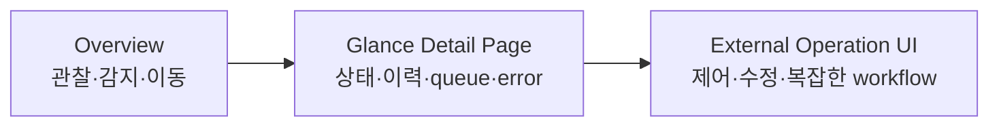

# 로컬 운영 대시보드 요구사항 분석

## 문서 목적

이 문서는 「Glance 기반 로컬 운영 대시보드 요구사항 및 구현 방향」을 현재 repository 구현과 대조한 결과다. 요구안을 구현 가능한 단위로 정규화하고, 이미 충족되는 부분과 구조 변경이 필요한 부분, 데이터 제공 측 전제, 아직 결정되지 않은 의미를 구분한다.

이 문서 작성 시 애플리케이션 코드는 수정하지 않았다.

## 결론 요약

Glance는 요구안이 정의한 **UI shell + page/router + widget layout + API renderer + template engine** 역할에 높은 적합성을 가진다. 특히 YAML page 구성, `custom-api`, 서버 측 HTML template, responsive column, theme, head widget은 Overview와 read-only detail page 구성에 그대로 사용할 수 있다.

다만 요구안의 세 가지 본체 변경은 난이도가 동일하지 않다.

| 변경 | 현재 기반 | 분석 결과 |
| --- | --- | --- |
| Card-level navigation | 공통 widget shell과 `title-url` 존재 | 공통 template·JS·CSS의 국소 변경으로 표현 가능 |
| Partial widget rendering | route와 interface 흔적 존재, 실제 handler는 501 | endpoint 골격은 있으나 widget 식별·인증·동시성·DOM 재초기화가 함께 필요 |
| Widget-level refresh | page load 갱신과 cache 모델만 존재 | page 단위 동기화 모델을 widget 단위로 분해해야 하는 핵심 구조 변경 |

따라서 가장 큰 작업 단위는 endpoint 자체가 아니라 **위젯별 동시성 경계와 브라우저 fragment 생명주기**다. 소스의 기존 TODO도 widget endpoint를 활성화하려면 page 전체가 아닌 widget별 locking이 필요하다고 명시한다.

## 제품 경계 정규화

### 목적

단일 사용자가 Tailscale 내부에서 여러 머신, 서비스, 데이터 파이프라인, 데이터베이스, backup, 외부 유료 API의 운영 상태를 빠르게 파악하는 경량 대시보드다.

핵심 사용자 행위는 세 가지다.

1. Observe: 현재 상태와 진행 상황을 본다.
2. Detect: 이상, 정체, stale data, 비용 초과 가능성을 발견한다.
3. Navigate: Glance detail page 또는 외부 운영 UI로 이동한다.

### 명시적 비목표

- Grafana와 같은 범용 observability 플랫폼
- Overview에서의 restart, retry, pause, resume, deploy, delete
- 복잡한 검색·필터·form·workflow
- raw payload 수정과 데이터 보정
- Glance 내부의 범용 control plane
- 모든 서비스 응답을 하나의 metric schema로 강제 통합

### 화면 계층



Overview와 Glance detail page는 기본적으로 read-only다. 상세 page에서 허용된 action도 refresh, log 열기, 외부 admin 열기 수준으로 제한된다.

## 요구사항 추적표

상태 표기:

- **충족**: 현재 기능만으로 표현 가능
- **부분 충족**: 기반은 있으나 요구 의미 전체는 충족하지 않음
- **미충족**: 현재 구현에 해당 동작 없음
- **외부 전제**: Glance보다 데이터 제공 서비스나 배포 환경의 책임

| ID | 정규화된 요구사항 | 상태 | 현재 구현과 간극 |
| --- | --- | --- | --- |
| R-01 | Tailscale 내부 단일 사용자 대시보드 | 외부 전제 | host bind와 `base-url`은 있으나 Tailscale 연결·ACL 설정은 Glance 밖의 배포 책임 |
| R-02 | Overview는 read-only Observe/Detect/Navigate 역할 | 충족 | YAML page와 widget으로 구성 가능. 현재 built-in widget도 표시·링크 중심 |
| R-03 | Attention을 최상위 정보로 표시 | 부분 충족 | `head-widgets`로 위치는 구현 가능하지만 여러 도메인 경고를 합치는 데이터 원천은 없음 |
| R-04 | Machine Health와 worst value | 부분 충족 | `server-stats`, `monitor`, `docker-containers`가 일부 값을 제공. 여러 머신 aggregate/worst 계산은 별도 응답 또는 Custom API template 필요 |
| R-05 | Pipeline freshness·flow·failure | 외부 전제 | built-in 도메인 없음. 상태 API가 있으면 `custom-api`로 표시 가능 |
| R-06 | Paid API usage·quota·burn rate·projection | 외부 전제 | provider별 usage/billing adapter가 필요. JSON endpoint 이후 표현은 가능 |
| R-07 | Public Web의 process·HTTP·dependency 상태 | 부분 충족 | `monitor`는 status/latency만 제공. request rate, error rate, users, dependency는 service telemetry API 필요 |
| R-08 | Database serviceability·capacity 요약 | 외부 전제 | 직접 DB query 기능 없음. HTTP/JSON adapter가 필요 |
| R-09 | Activity feed | 부분 충족 | RSS나 `custom-api` list template로 표현 가능. 여러 시스템 event 통합 원천은 없음 |
| R-10 | Backrest 기반 backup 요약 | 외부 전제 | 전용 widget 없음. Backrest 또는 adapter가 제공하는 HTTP 응답 필요 |
| R-11 | 카드에서 Glance detail page 이동 | 부분 충족 | page/slug는 충족. 제목 링크만 있으며 카드 전체 navigation은 없음 |
| R-12 | detail에서 외부 Operator UI 이동 | 충족 | `title-url`, template link, bookmarks 등을 사용 가능 |
| R-13 | 운영 widget을 `custom-api` 중심으로 구현 | 충족 | POST/body/header/query/Basic Auth/subrequest/GJSON/Go template 지원 |
| R-14 | widget별 2초–1분 주기 view refresh | 미충족 | 최초 page content 요청 이후 자동 서버 refresh 없음 |
| R-15 | widget HTML fragment endpoint | 미충족 | route는 등록되어 있지만 handler가 즉시 501 반환 |
| R-16 | backend cache와 browser refresh 분리 | 부분 충족 | backend cache 판단은 이미 존재. 독립 browser refresh 속성이 없음 |
| R-17 | server-side fragment rendering 유지 | 충족 기반 | 모든 widget이 `Render() template.HTML` 계약을 가짐 |
| R-18 | JSON-RPC read API 활용 | 충족 기반 | `custom-api`가 POST JSON body와 template JSON path를 지원. JSON-RPC 의미 자체는 외부 API 책임 |
| R-19 | read/control API 분리 | 외부 전제 | Glance는 method 이름의 의미를 강제하지 않음. Overview config가 read method만 호출하는 규칙 필요 |
| R-20 | Overview 그래프 최소화 | 충족 | custom HTML과 기존 숫자/list/progress 스타일로 구성 가능 |

## 도메인별 데이터 준비도

화면을 만드는 능력과 필요한 값을 얻는 능력은 구분해야 한다. Glance는 HTTP 응답을 표시하는 데 강하지만 DB나 pipeline 내부 상태를 스스로 발견하지 않는다.

### Machine Health

현재 사용할 수 있는 요소:

- `server-stats`: local gopsutil 또는 원격 `/api/sysinfo/all` 형식
- `monitor`: online/offline과 HTTP latency
- `docker-containers`: Docker socket/API의 container 상태
- `custom-api`: 임의 machine agent 응답

현재 `server-stats`는 WIP로 표시되며 repository 안에는 원격 agent server가 포함되어 있지 않다. 여러 머신의 `max CPU/RAM/disk`, online count, Attention count를 한 카드로 만들려면 단일 aggregate endpoint, Custom API subrequests, 또는 template 계산 중 하나가 필요하다.

`telemetry freshness`와 backup 상태는 gopsutil 결과에 포함되지 않으므로 별도 timestamp와 backup 데이터가 필요하다.

### Data Pipeline

Glance 내부에는 pipeline 개념이 없다. 요구한 감지 능력을 위해 데이터 제공 측이 최소한 다음 사실을 노출해야 한다.

- source/result 기준 시각
- 상태별 work count
- oldest queued item의 시각 또는 age
- processing rate와 그 계산 window
- failed/retry/invalid count
- last progress time
- 현재 run과 최근 run

프로세스 health와 progress health는 별도 값이어야 한다. worker process가 살아 있어도 `last_progress_at`이 오래되거나 oldest queue age가 증가하면 정체로 판정할 수 있어야 하기 때문이다.

### Paid API Usage / Cost

표시에 필요한 최소 데이터는 period, current usage/cost, limit/budget, reset time이다. burn rate와 projected month-end 값이 provider 응답에 없다면 adapter 또는 template에서 계산해야 한다.

Provider마다 단위가 비용, token, request, quota point로 다르므로 전체 metric schema를 통일할 필요는 없지만 공통 시각 문법을 위해 다음 의미는 구분되어야 한다.

- absolute value와 단위
- limit 대비 ratio
- projection과 prediction timestamp
- reset 또는 billing period 경계
- warning/critical 판정 결과

### Public Web Server

기존 `monitor`가 제공하는 값은 status code, response time, timeout/error다. 요구한 process, dependency, request rate, 4xx/5xx, active users는 단순 health URL만으로 얻을 수 없다.

서비스가 종합 health/telemetry endpoint를 제공하거나 여러 endpoint를 Custom API subrequest로 묶어야 한다. `last successful health check`가 Glance poll 시각인지 서비스 내부 성공 시각인지도 구분할 필요가 있다.

### Database Health

Glance는 DB driver와 query 실행 계층이 없다. Postgres connections, pool, locks, replication lag, WAL, slow query는 DB 또는 application 측 HTTP adapter가 노출해야 한다.

Overview용 응답은 서비스 가능 여부, connection ratio, storage ratio, slow query/lock/replication의 attention count처럼 축약된 값이면 충분하다. query text나 세션 종료 같은 제어는 요구 범위상 외부 운영 UI에 속한다.

### Attention

Attention은 단순 widget 표시 문제가 아니라 **여러 도메인의 이상을 하나의 순서 있는 목록으로 합치는 문제**다. 요구안은 각 서비스 schema를 통일하지 않아도 된다고 명시하지만, 통합 Attention에는 최소한 다음 중 한 경계가 필요하다.

1. 각 source를 이해하는 별도 aggregate endpoint
2. Custom API subrequest와 하나의 template 안에 모든 판정 규칙 작성
3. 각 서비스가 최소 alert envelope만 공통으로 제공

세 번째 방식의 최소 envelope 예시는 `severity`, `source`, `summary`, `occurred_at`, `detail_url` 수준이다. 전체 metric schema의 통일과 alert envelope의 통일은 별개의 문제다.

정렬 기준도 요구안에 아직 고정되어 있지 않다. 일반적으로 문서 예시는 severity 우선, 같은 severity에서는 최신 또는 영향도 순서를 암시한다.

### Activity

기존 RSS 위젯 또는 Custom API list가 시각 표현에는 적합하다. 여러 서비스 event를 하나로 합치려면 event time, source, type, summary, detail URL 정도의 통합 기준이나 aggregate feed가 필요하다.

Activity는 상태가 아니라 이력이므로 event ID, 정렬 기준, 최대 보존 기간, 중복 제거 책임이 데이터 제공 측에 있어야 한다. Glance 메모리 cache는 event 저장소가 아니다.

### Backup

요구 값은 마지막 시도와 마지막 성공을 구분해야 한다. 최근 시도가 실패한 경우 `last backup`만으로는 실제 복구 가능한 최신 시점을 알 수 없기 때문이다.

Backrest 연동에 필요한 실제 API 경로, 인증, 응답 schema는 요구안에 아직 포함되지 않았다. 현재 Glance에는 Backrest 전용 adapter가 없으므로 HTTP API가 직접 사용 가능하지 않으면 중간 adapter가 필요하다.

## 현재 레이아웃과 UX 적합성

### Overview

- `head-widgets`는 Attention처럼 전체 열 위에 놓이는 영역에 적합하다.
- page는 최대 3개의 column을 허용하고 최소 하나의 `full` column이 필요하다.
- `split-column`은 한 column 내부에 여러 카드를 배치할 수 있어 예시의 Machines/Web/DB 행을 표현할 수 있다.
- `group`은 같은 위치에 여러 widget을 tab으로 묶지만 Overview의 즉시 가시성 원칙과는 사용 목적이 다르다.
- 기존 progress, list, color utility를 Custom API template에서 재사용할 수 있다.

### Detail page

page와 slug는 이미 요구 구조를 지원한다. 다만 현재 desktop/mobile navigation은 `Config.Pages` 전체를 순회한다. **카드에서만 접근하는 detail page를 전역 navigation에서 숨기는 속성은 없다.** detail page 수가 늘면 navigation에 모두 노출된다.

각 detail page에서 `hide-desktop-navigation`을 설정할 수는 있지만, 이는 그 page 안의 navigation을 숨길 뿐 다른 page의 전역 navigation 목록에서 해당 detail link를 제거하지 않는다.

### 정보 위계

기존 theme는 primary/positive/negative 색상, notice icon, error frame을 제공한다. Attention → Health → Activity → Flow → Capacity/Cost → History 순서는 widget 배치와 template markup으로 표현할 수 있으며 새로운 layout engine을 요구하지 않는다.

## 핵심 변경 1: Widget-level refresh

### 현재 상태

- widget update는 page content 요청 안에서만 호출된다.
- page mutex가 그 page의 모든 widget update와 전체 fragment render를 감싼다.
- widget 자체에는 mutex가 없다.
- 공통 template renderer는 widget별 `bytes.Buffer`를 재사용한다.
- update는 widget view model을 직접 변경한다.

따라서 partial 요청을 단순히 기존 `update()`와 `Render()`에 연결하면 page 요청, 다른 refresh 요청과 동시에 같은 구조체와 buffer를 읽고 쓰는 data race가 발생할 수 있다.

### 필요한 의미 분리

요구안의 두 시간 축은 현재 cache 모델과 잘 대응한다.

```text
refresh: 브라우저가 새 HTML fragment를 요청하는 간격
cache:   서버가 upstream 데이터를 다시 취득할 수 있는 최소 간격
```

Partial handler는 위젯 lock 안에서 다음 순서를 보장해야 하는 의미가 된다.

```text
lock widget
if cache expired:
    update upstream data
render current widget HTML
unlock widget
```

두 browser가 동시에 같은 widget을 polling해도 첫 요청만 upstream fetch하고 다음 요청은 그 결과를 렌더링하는 것이 현재 cache 의미와 일치한다.

### 아직 정의되지 않은 refresh 의미

다음은 구현 전에 요구 의미가 고정되어야 하는 항목이다.

- `refresh` 미지정 시 polling 비활성화인지 기본 주기 적용인지
- `refresh: 0s` 허용 여부와 disabled 의미
- 허용 최소·최대 값
- hidden browser tab에서 polling 지속 여부
- group의 비활성 tab widget polling 여부
- 요청 시간이 interval보다 길 때 중첩 요청 허용 여부
- 실패 시 동일 주기, browser backoff, server의 기존 조기 재시도 중 무엇을 적용할지
- 수동 refresh가 cache를 무시하는 강제 fetch인지 단순 view rerender인지
- 여러 client의 polling 시각을 분산하기 위한 jitter 여부

현재 duration parser는 초 단위를 지원하므로 `2s`, `5s`, `10s`, `1m` 형식 자체는 처리할 수 있다. 다만 현재 `cache: 0s`는 `CustomCacheDuration == 0` 조건 때문에 기본 cache로 해석되어 cache 비활성화 의미로 사용할 수 없다.

## 핵심 변경 2: Partial widget rendering

### 기존 확장 지점

현재 mux에는 `/api/widgets/{widget}/{path...}`가 등록되어 있고 `widgetByID`, `handleWidgetRequest` interface가 존재한다. application handler 내부에도 ID parse, lookup, 위임 코드가 주석으로 남아 있다.

그러나 현재 상태는 다음과 같다.

- handler가 즉시 501을 반환한다.
- route에 HTTP method 제한이 없다.
- 인증 검사가 없다.
- 공통 widget wrapper에 ID나 endpoint metadata가 없다.
- `widgetByID`에는 page의 최상위 head/column widget만 들어간다.
- group/split-column 내부 child widget은 map에 등록되지 않는다.

### Widget ID 수명

ID는 YAML decode 때 process 전역 atomic counter로 생성된다. 명시적이고 안정적인 config ID가 아니다.

- 같은 application 수명 안에서는 map key로 사용할 수 있다.
- 설정 재로드 때 모든 widget이 새 ID를 받는다.
- counter는 reset되지 않으므로 같은 위치의 widget도 이전 ID를 재사용하지 않는다.
- 열린 browser document는 재로드 사실을 모르고 이전 ID로 polling을 계속할 수 있다.

따라서 endpoint가 runtime ID를 사용할 경우 stale document 요청에 대한 404/410 처리와 page 재동기화 의미가 필요하다. 영구 bookmark용 ID가 아니라 현재 document와 application generation 사이의 임시 handle로 보는 것이 현재 구조에 맞다.

### 동시성 경계

위젯별 mutex는 적어도 다음을 함께 보호해야 한다.

- `requiresUpdate`가 읽는 `nextUpdate`
- update가 변경하는 domain view model
- Error, Notice, ContentAvailable, retry count
- `templateBuffer`

초기 page content도 동일한 widget lock을 사용해야 partial endpoint와 상호 배제된다. 기존 page mutex만 유지한 채 partial endpoint에 별도 lock을 추가하면 lock 순서와 중복 locking 문제가 생길 수 있으므로 page rendering의 동기화 경계도 함께 정리되어야 한다.

### Request context

widget interface는 `update(context.Context)`를 받지만 page는 `context.Background()`를 전달한다. 여러 widget 구현도 전달받은 context를 실제 outbound request에 사용하지 않는다. Custom API도 내부에서 새 `context.Background()`를 만든다.

따라서 browser가 partial fetch를 취소하거나 연결을 끊어도 현재 update 작업 전체가 자동 취소되지는 않는다. 기본 HTTP client timeout이 대부분의 요청을 5초 후 끝내지만 Extension은 client timeout이 없다.

### Fragment 응답

현재 모든 widget의 `Render()`가 공통 `.widget` root를 포함한 HTML을 반환하므로 root 전체 교체가 가능하다. 그러나 root에는 runtime ID가 없으므로 endpoint 연결용 attribute 추가가 필요하다.

응답 의미상 구분이 필요한 상태는 다음과 같다.

- 정상 HTML
- 인증 만료 401
- 설정 재로드로 사라진 ID 404/410
- update 실패지만 last-good content가 있는 HTML
- update와 render가 모두 실패한 500

기존 widget 오류 모델은 upstream 실패 자체를 HTTP 실패로 만들기보다 widget frame 안에 Error/Notice를 표시한다. Partial rendering도 이 의미를 유지해야 기존 widget과 호환된다.

## 브라우저 fragment 생명주기

HTML을 교체하는 것만으로 모든 widget이 다시 동작하지는 않는다. 최초 page load 후 `page.js`가 다음 기능을 한 번 초기화하기 때문이다.

- popover
- clock
- calendar dynamic module
- todo dynamic module
- carousel
- search box
- collapsible list/grid
- group tabs
- masonry
- dynamic relative time
- lazy image
- 잘린 text title

현재 setup 함수는 대부분 document 전체를 조회하며 반복 실행을 전제로 하지 않는다. 같은 함수들을 fragment 교체 때 다시 전역 실행하면 event listener, expand button, timer가 중복될 수 있다.

Partial refresh가 모든 기존 widget에 일반적으로 적용되려면 초기화 함수를 **특정 root subtree에 대해 idempotent하게 실행**하고 교체 전 timer/listener/component를 정리하는 생명주기가 필요하다.

Custom API 운영 카드처럼 상호작용이 없는 fragment만 refresh 대상으로 제한하면 초기 범위는 작아지지만, 요구안의 “기존 custom-api 및 community widget 호환”이 어느 수준까지인지 명시해야 한다.

DOM 교체로 사라질 수 있는 상태도 있다.

- group에서 선택한 tab
- 펼친 목록 상태
- input focus와 selection
- calendar가 이동한 월
- Todo 편집 중 상태
- iframe 내부 문서 상태
- 이미지 load와 carousel scroll 위치

운영용 read-only Custom API 카드에는 대부분 해당하지 않지만 generic widget refresh 계약에는 포함되는 문제다.

Timer는 `setInterval`보다 한 요청이 끝난 뒤 다음 `setTimeout`을 예약하는 방식의 의미가 요구사항에 더 부합한다. 요청이 5초 걸리는 widget에 2초 interval을 지정해도 같은 widget 요청이 중첩되지 않기 때문이다.

## 핵심 변경 3: Card-level navigation

### 현재 상태

- 모든 widget은 `title-url`을 지원한다.
- title link는 항상 새 tab과 `rel="noreferrer"`를 사용한다.
- widget root는 단순 `<div class="widget ...">`이고 click/keyboard navigation 정보가 없다.

### 요구 의미

`href: /pipeline-youtube`는 `base-url`을 고려해 같은 tab의 Glance detail page로 이동하는 의미를 암시한다. 카드 안의 button, link, input, textarea, select 등 interactive descendant에서 발생한 click은 card navigation을 실행하지 않아야 한다.

전체 widget을 `<a>`로 감싸면 Custom API template 안의 link/button과 HTML 중첩 규칙이 충돌한다. 현재 구조와 호환되는 방식은 root에 data attribute를 두고 delegated click/keyboard handler가 interactive target을 제외하는 형태다.

이 경우에도 다음 의미가 필요하다.

- relative path에 `base-url`을 자동 적용할지
- absolute external URL 허용 여부
- 새 tab을 위한 별도 `target` 속성 여부
- `title-url`과 `href`가 동시에 있을 때 우선순위
- keyboard focus와 Enter/Space 동작
- group/split-column 컨테이너 전체에 href를 허용할지
- drag, text selection, nested card click 처리

접근성 관점에서는 마우스 click만 추가해서는 카드가 keyboard 탐색 가능한 link가 되지 않는다. root의 focus 가능성, role, 이름을 함께 정의해야 한다.

## Custom API 적합성

현재 `custom-api`는 요구안의 주요 adapter 역할을 이미 지원한다.

- GET을 포함한 임의 method
- query parameter와 header
- JSON 또는 string body
- Basic Auth
- 인증서 검증 해제 옵션
- primary와 named subrequest 병렬 실행
- GJSON path와 typed helper
- response status/header 접근
- Go HTML template와 공통 CSS class
- template 안에서 추가 request 생성

JSON-RPC는 POST body에 `jsonrpc`, `method`, `params`, `id`를 설정해 호출할 수 있다. 응답 envelope의 `result`를 GJSON으로 읽으면 된다.

현재 구현의 status 처리에는 한 가지 특성이 있다. 응답 body가 유효한 JSON이면 HTTP non-2xx도 자동 오류로 바꾸지 않고 template data로 전달한다. JSON-RPC error envelope이나 JSON 오류 body는 template이 `.Response.StatusCode`와 JSON error 필드를 명시적으로 처리해야 한다.

Subrequest는 한 widget 안의 여러 source를 병렬로 묶는 데 적합하지만 하나라도 transport/JSON validation 오류가 나면 전체 update를 실패시키고 다른 요청을 cancel한다. Attention aggregate가 일부 source 실패 상태 자체를 표시해야 한다면 각 source를 항상 유효한 상태 JSON으로 반환하는 adapter 계약이 더 안정적이다.

## Cache와 freshness 의미

요구안에서 cache와 refresh를 구분한 것은 현재 구현과 자연스럽게 맞는다. 다만 운영 대시보드에서는 세 종류의 시각을 혼동하지 않아야 한다.

| 시각 | 의미 |
| --- | --- |
| Source timestamp | pipeline/DB/service에서 실제 상태가 마지막으로 바뀐 시각 |
| Glance fetch timestamp | Glance가 upstream 응답을 마지막으로 성공 취득한 시각 |
| View refresh timestamp | browser가 widget HTML을 마지막으로 교체한 시각 |

`refresh: 2s`, `cache: 10s`에서 view는 2초마다 다시 렌더링되지만 source timestamp는 upstream 작업이 진행할 때만 바뀌고 Glance fetch timestamp는 최대 10초 간격으로 바뀐다.

Freshness와 `last progress` 판정은 browser refresh 시각이 아니라 source가 제공한 timestamp를 기준으로 해야 한다. 그렇지 않으면 오래된 data를 자주 다시 렌더링하면서 최신으로 오인할 수 있다.

현재 widget cache는 성공 시 다음 정상 만료를 잡고 실패 시 1, 4, 9, 16, 25분 조기 재시도를 사용한다. 2초 polling을 추가해도 upstream error 재시도는 이 server cache 정책에 의해 제한된다. 요구한 실시간 운영 카드에서 이 오류 backoff가 적합한지는 별도 의미 결정이 필요하다.

## Tailscale 배포 경계

Glance가 Tailscale을 직접 인식하는 코드는 없다. `server.host`로 Tailscale interface 주소에 bind하거나, 모든 interface에 bind한 뒤 OS firewall/Tailscale ACL, 또는 reverse proxy/Tailscale Serve로 접근 범위를 제한해야 한다.

기본 host는 빈 문자열이므로 모든 interface에서 listen한다. 단순히 머신이 Tailscale에 연결되어 있다는 사실만으로 public/LAN interface 노출이 자동 차단되지는 않는다.

현재 Glance 인증은 선택 사항이다. Tailscale identity/ACL만 신뢰할지 Glance password도 함께 사용할지는 요구안에 명시되지 않았다. 어느 쪽이든 새 widget fragment endpoint는 page content API와 동일한 인증 경계를 가져야 한다.

HTTPS를 reverse proxy 또는 Tailscale Serve에서 종료할 경우 `X-Forwarded-Proto: https`가 전달되어야 session cookie에 Secure가 설정된다.

## Read와 Control 분리

요구안의 read/control 구분은 제품 경계로 명확하다. 다만 현재 `custom-api`는 임의 HTTP method와 body를 지원하므로 기술적으로 control method 호출도 가능하다. Glance가 method name을 분석해 차단하지는 않는다.

현재 요구를 만족시키는 경계는 다음 세 층에 존재한다.

- YAML policy: Overview와 detail config에는 read method만 선언
- API authorization: read credential과 control credential 분리
- Network/UI: control endpoint와 Operator UI는 별도 경로·서비스로 노출

Overview read-only는 UI에 button이 없다는 것뿐 아니라 Glance가 가진 credential 자체가 destructive control을 수행할 수 없는 상태일 때 더 강하게 성립한다. 이 부분은 외부 API 인증 설계의 책임이다.

## 비기능 요구 분석

원문에 수치로 명시되지는 않았지만 다음 비기능 속성이 목표에서 도출된다.

### 최신성

- Machine/Pipeline/Web: 2–10초 view refresh
- Cost/Backup: 1분 수준
- 각 값에 source timestamp 또는 age 표시
- stale telemetry를 healthy와 구분

### 부분 실패 내성

- 하나의 source 실패가 Overview 전체를 가리지 않아야 함
- last-good 값과 현재 fetch 오류를 동시에 표현할 수 있어야 함
- Attention aggregate가 source 자체의 unavailable을 경고로 변환할 수 있어야 함

현재 page load는 모든 만료 widget을 기다리므로 timeout 없는 Extension 하나가 전체 초기 콘텐츠를 지연시킬 수 있다. Partial lifecycle은 초기 page load와 별도로 각 카드 실패를 격리하는 효과도 요구하게 된다.

### 부하

browser refresh가 cache보다 짧으면 upstream 호출은 cache로 억제되지만 server render와 Tailscale traffic은 refresh마다 발생한다. 실제 부하는 다음 값의 곱이다.

```text
열린 client 수 × refresh widget 수 × 초당 refresh 빈도
```

단일 사용자라도 Windows PC와 MacBook에서 동시에 열 수 있으므로 backend cache는 client별이 아니라 현재처럼 application 전역 widget instance에 공유되는 의미가 적합하다.

### 가독성

- Overview는 attention, worst value, count, age 중심
- 상세 history를 Overview로 끌어오지 않음
- 그래프는 필요한 추세에만 sparkline 사용
- healthy 항목보다 abnormal/stale/backlog를 우선 표시

이 부분은 기존 layout과 Custom API template만으로 충족 가능하며 새로운 chart framework를 요구하지 않는다.

## 주요 위험과 영향도

| 항목 | 영향 | 근거 |
| --- | --- | --- |
| Widget data race | 높음 | update 모델과 template buffer가 mutable이고 현재 widget lock 없음 |
| Fragment 재초기화 중복 | 높음 | page setup 함수가 document 전체와 최초 1회 실행을 전제 |
| 설정 재로드 후 stale ID | 높음 | widget ID가 application 재생성마다 바뀌며 열린 browser는 유지됨 |
| 초기 page waterfall 유지 | 중간 | 최초에는 여전히 page content가 모든 widget update 완료를 기다림 |
| Attention source coupling | 중간 | schema 비통일 원칙과 전역 aggregate 사이에 adapter 경계 필요 |
| Detail navigation 과밀 | 중간 | 모든 page가 전역 nav에 자동 노출됨 |
| Tailscale 외 interface 노출 | 높음 | 기본 bind가 모든 interface이며 Glance가 tailnet을 인식하지 않음 |
| 고빈도 polling 부하 | 중간 | cache hit이어도 HTML render와 network response는 매 interval 발생 |
| Interactive widget 상태 손실 | 중간 | root DOM 교체가 local UI state와 timer를 제거 |
| Upstream 취소 불완전 | 중간 | update context가 다수 HTTP request까지 전달되지 않음 |

## 결정이 필요한 요구사항

### 구조 변경 전 필수 결정

1. `refresh`는 명시한 widget만 활성화하고 미지정은 기존 동작을 유지하는가?
2. Partial refresh 1차 범위는 최상위 `custom-api` 위젯만인가, 모든 built-in과 container child까지인가?
3. runtime numeric ID를 document 수명 handle로 사용할 것인가, YAML에 안정 ID를 도입할 것인가?
4. 설정 재로드로 stale ID가 되면 widget polling을 중지할지 page 전체를 reload할지?
5. fragment 교체 후 지원해야 하는 JS 동작 범위는 어디까지인가?
6. widget update/render의 mutex 소유자는 `widgetBase`인가 별도 wrapper인가?
7. 인증 활성화 시 partial endpoint가 content API처럼 401을 반환한다는 의미를 확정할 것인가?

### UX 결정

8. detail page를 global navigation에서 숨길 수 있어야 하는가?
9. card `href`는 내부 relative URL만 허용하는가?
10. card href와 title-url이 함께 있을 때 click 영역과 tab target은 어떻게 되는가?
11. hidden tab, background browser, group 비활성 tab의 polling을 멈추는가?
12. fragment 교체 시 group/collapse/focus 상태를 보존해야 하는가?

### 데이터 계약 결정

13. Attention을 별도 aggregator가 만들지 Custom API template가 직접 조합할지?
14. warning/critical threshold는 source, adapter, YAML template 중 어디가 소유하는가?
15. 공통 alert/activity envelope를 도입할지?
16. freshness는 어떤 source timestamp를 기준으로 하고 timezone/clock skew를 어떻게 다룰지?
17. burn rate와 projected cost의 계산 window와 budget period는 무엇인지?
18. Backrest에서 사용할 API와 인증 방식은 무엇인지?

### 배포 결정

19. Glance가 Tailscale IP에 직접 bind할지 Tailscale Serve/reverse proxy 뒤에 둘지?
20. Tailscale ACL만 사용할지 Glance password 인증도 사용할지?
21. Glance가 사용할 read credential을 control 권한과 별도로 발급할 수 있는지?

## 요구안 단계별 분석 완료 조건

원문의 단계 구분을 구현 결과가 아니라 분석 가능한 검증 조건으로 바꾸면 다음과 같다.

### Phase 1 — 구조 분석

현재 [architecture.md](architecture.md), [runtime-http.md](runtime-http.md), [widgets.md](widgets.md), [frontend.md](frontend.md), [security.md](security.md)와 본 문서가 다음 항목을 다룬다.

- widget 초기화, cache, update, render
- page load와 widget update 결합
- Custom API request, JSON, template, 오류
- page slug, lookup, navigation
- widget shell과 card navigation 삽입 지점
- partial route와 현재 비활성 이유

### Phase 2 — 최소 본체 변경의 요구 수준

구현 완료를 판정하려면 최소한 다음 동작이 관찰 가능해야 한다.

- `refresh` 미지정 widget은 기존 동작과 동일
- 서로 다른 refresh interval이 한 page에서 독립 실행
- `refresh < cache`일 때 upstream 호출은 cache interval을 넘지 않음
- 같은 widget의 요청이 중첩되지 않음
- page render와 partial render를 race detector가 문제 없이 처리
- 인증된 dashboard에서 fragment endpoint도 인증 요구
- upstream 실패 시 widget 오류/last-good 표현 유지
- 설정 재로드 후 stale browser 동작이 정의된 방식으로 종료 또는 회복
- fragment 교체 후 범위로 정한 JS 기능이 중복 없이 동작
- nested interactive element click은 card navigation을 유발하지 않음
- card navigation을 keyboard로도 수행 가능

### Phase 3 — 운영 카드의 데이터 준비 수준

각 카드 구현 전에 해당 source에 대해 다음이 식별되어야 한다.

- endpoint와 인증 방식
- response 예시와 단위
- source timestamp
- healthy/warning/critical 조건
- cache와 refresh 주기
- detail page URL
- external Operator UI URL
- 실패 시 last-good/stale 표시 의미

## 최종 평가

요구안의 제품 경계는 일관적이다. Glance를 control plane이 아니라 관찰·감지·이동 shell로 사용하고, 도메인별 JSON을 Custom API가 표현하게 하는 방향은 현재 코드의 강점을 그대로 활용한다.

현재 구현과 가장 큰 간극은 운영 카드 자체가 아니라 widget별 refresh를 안전하게 만드는 기반이다. Partial endpoint의 흔적은 이미 있지만 page mutex, mutable widget state, 공유 template buffer, 불안정 runtime ID, 일회성 frontend initializer 때문에 endpoint 몇 줄을 활성화하는 수준으로 끝나지 않는다.

또한 Attention과 Activity는 “공통 metric schema 불필요” 원칙 안에서도 최소한의 aggregate 경계가 필요하다. Machine, Pipeline, Cost, Web, DB, Backup의 실제 API와 timestamp·threshold 소유권이 정해져야 화면이 최신 상태와 단순 재렌더를 구분할 수 있다.

정리하면 현재 요구안은 Glance 기반으로 실현 가능하며, 분석상 선행 결정은 세 묶음이다.

1. widget identity·locking·fragment lifecycle
2. refresh/cache/failure의 정확한 시간 의미
3. Attention·Activity를 위한 데이터 aggregate 경계와 Tailscale 인증 경계

